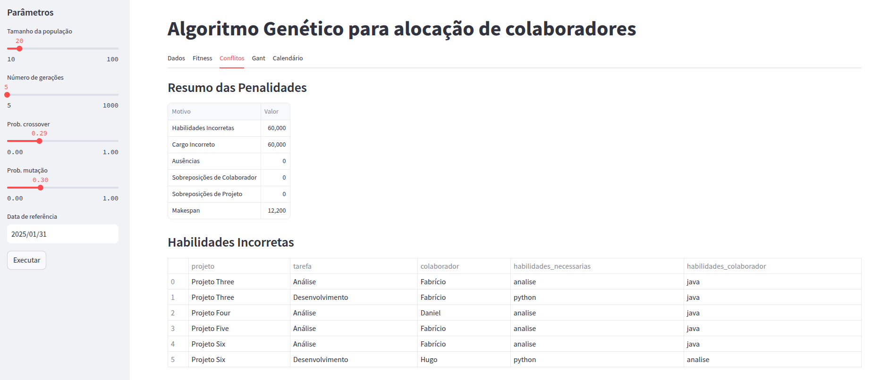
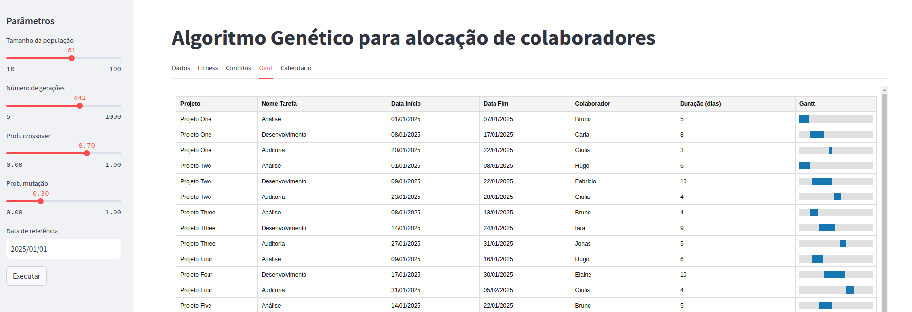

# Documentação Final do Projeto

## 1. Definição do Problema

Este projeto aborda o desafio de alocação eficiente de colaboradores em tarefas de projetos, considerando habilidades específicas dos membros da equipe, ausências, cargos e possíveis conflitos de agenda.

Como solução, desenvolveu-se um Algoritmo Genético que otimiza a distribuição das tarefas, reduzindo o tempo total de execução dos projetos (makespan) e diminuindo penalidades decorrentes de alocações inadequadas (incompatibilidades de habilidades, cargos e agenda).

### Objetivos Principais

* Maximizar a eficiência na distribuição das tarefas.
* Garantir o respeito às restrições de habilidades, cargos, ausências e sobreposições de tarefas.
* Disponibilizar uma interface interativa, criada em Streamlit, para ajuste de parâmetros do algoritmo (tamanho da população, número de gerações, probabilidade de crossover e mutação), além de proporcionar a visualização de resultados em tabelas, gráficos de evolução da fitness, calendários e gráficos de Gantt.

### Critérios de Sucesso

* Encontrar soluções que atendam a todas as restrições definidas.
* Oferecer uma interface intuitiva, que facilite a configuração de parâmetros.
* Disponibilizar visualizações (tabelas, Gantt e calendário) claras e informativas.
* Comparar o desempenho do algoritmo genético com métodos convencionais, buscando potenciais ganhos de eficiência.

## 2. Testes e Resultados

### Testes com Variáveis de Parâmetros

* Avaliou-se o comportamento do algoritmo ao variar o tamanho da população, o número de gerações e as probabilidades de crossover e mutação.
* Monitorou-se a evolução da melhor fitness ao longo das gerações.

### Comparação com Métodos Convencionais

* Nós comparamos o processo de alocação manual com a gerada pelo software, e percebeu-se que o gerado pelo algoritmo além de ser mais rápido foi bem mais preciso.

### Validação de Restrições

* Verificou-se se as alocações respeitam habilidades, cargos, ausências e
evitam sobreposições de tarefas para cada colaborador.

### Análise de Convergência

* Acompanhou-se a evolução da fitness para avaliar a convergência do algoritmo para soluções de melhor qualidade.

### Resultados Esperados

* Redução do tempo total de execução dos projetos (makespan) em comparação a métodos simples.
* Baixo índice de conflitos de alocação nas soluções geradas.
* Visualizações claras do cronograma das tarefas, utilizando tabela, gráfico de Gantt e calendário interativo.
* Aplicabilidade comprovada em cenários reais de alocação de recursos, tais como equipes de desenvolvimento de software e de engenharia.

## 3. Arquitetura do Projeto

### Estrutura do Código

* **Utils**: Responsável por funções utilitárias, como a conversão de datas em dias corridos em relação a uma data de referência. Isso simplifica bastante o tratamento de intervalos temporais no restante da aplicação.

* **DataManager**: Responsável pela leitura de arquivos JSON (contendo listas de colaboradores e projetos) e pela organização das tarefas. Cada projeto possui um conjunto de etapas (tarefas), e cada colaborador possui atributos relevantes (habilidades, cargo, ausências etc.). Essa classe consolida os dados em uma estrutura unificada (tarefas_globais) para uso no algoritmo.

* **GeneticAlgorithm**: Engloba toda a lógica do Algoritmo Genético: geração de população inicial, avaliação (cálculo de fitness), seleção de indivíduos, crossover, mutação e formação de novas gerações até o número definido de iterações.

* **Visualization**: Concentrada em funções de visualização dos resultados. Inclui a geração de um calendário interativo (usando FullCalendar), a verificação de conflitos (para detecção de sobreposições de tarefas) e um método para produção de um Gantt simplificado em HTML.

* **App**: Classe principal implementada com Streamlit. É aqui que o usuário final interage com o sistema, definindo parâmetros (tamanho da população, número de gerações etc.) e obtendo as saídas: tabela de tarefas, gráficos de evolução da fitness, conflitos, calendário e Gantt.

### Funcionalidades Principais

* **Leitura e Organização de Dados**: A classe DataManager carrega e estrutura todos os dados necessários (colaboradores, habilidades, ausências, projetos e etapas).

* **Evolução via Algoritmo Genético**: A classe GeneticAlgorithm faz todo o trabalho de evolução dos indivíduos, orientando a população rumo a soluções com melhor fitness.

* **Visualização de Resultados**:
  * **Calendário (FullCalendar)**: Permite verificar rapidamente em que dias cada tarefa se inicia e termina, colorindo-as de acordo com o projeto.
  * **Tabela Gantt Simplificada**: Facilita a visualização do cronograma, representando cada tarefa em linhas e mostrando intervalos no tempo.
  * **Verificação de Conflitos**: Detecta sobreposições de tarefas dentro do mesmo projeto ou para o mesmo colaborador.

* **Aplicação Web (Streamlit)**: Os parâmetros do GA são ajustados em tempo real pelo usuário na barra lateral (tamanho da população, número de gerações, probabilidade de crossover e mutação). Ao final de cada execução, a aplicação exibe os resultados em diferentes abas (tabela, calendário, Gantt e evolução da fitness).

### Prints das telas

Na aba "Dados" são exibidos os dados dos projetos e colaboradores.

Na aba "Fitness" é exibido o gráfico de evolução da fitness ao longo das gerações.

Na aba "Conflitos" são exibidos os conflitos de alocação.

Na aba "Gantt" é exibido o gráfico de Gantt com as alocações geradas pelo algoritmo.

Na aba "Calendário" é exibido o calendário interativo com as tarefas alocadas com a possibilidade de visualizar as tarefas por dia, semana ou mês. Nessa aba ainda é possível aplicar filtros para visualizar apenas tarefas de um projeto  ou colaborador específico.

### Funcionamento Detalhado do Algoritmo Genético

O Algoritmo Genético (GA) é a peça central do projeto, responsável por encontrar (ou aproximar-se de) uma solução ótima para a alocação de colaboradores nas tarefas. Abaixo, descrevemos cada etapa em detalhes:

* **Representação do Indivíduo**: Cada indivíduo da população representa uma alocação completa das tarefas. Para cada tarefa, associa-se um colaborador. Na prática, o indivíduo é uma lista em que a posição i corresponde à tarefa i, e o valor nessa posição é o ID do colaborador selecionado.

* **População Inicial**: A população inicial é criada de forma aleatória. Cada indivíduo (solução) recebe colaboradores de maneira randômica para cada tarefa. Tamanhos de população muito grandes aumentam a diversidade, mas demandam mais esforço computacional. Por outro lado, populações pequenas podem limitar a busca do GA.

* **Avaliação (Cálculo de Fitness)**: A aptidão de cada indivíduo é avaliada considerando múltiplos aspectos:
  * **Compatibilidade de Habilidades**: Se o colaborador alocado possui as habilidades necessárias para aquela tarefa. Incompatibilidades geram penalidade.
  * **Cargo Adequado**: Se o cargo do colaborador é o exigido pela tarefa. Incorreções geram penalidade alta.
  * **Ausências**: Caso a tarefa seja realizada em um período em que o colaborador esteja ausente, atribui-se nova penalidade.
  * **Sobreposições de Tarefas**: Verifica-se se o mesmo colaborador está alocado em tarefas que se sobrepõem no tempo. Cada conflito gera penalidade.
  * **Sobreposições no Mesmo Projeto**: Controla se as etapas de um projeto estão ocorrendo em paralelo quando não deveriam, gerando penalidade se houver conflito.
  * **Makespan**: O tempo total de conclusão de todos os projetos também entra no cálculo, sendo multiplicado por um peso específico (por exemplo, 500) para enfatizar a importância de reduzir o tempo final.

Ao final, soma-se todas as penalidades para compor o valor de fitness. Quanto menor a penalidade total, melhor o indivíduo.

* **Seleção**: Para criar a próxima geração, o algoritmo seleciona os indivíduos mais aptos (com menor fitness) por meio de um processo como o torneio. Nesse método, escolhe-se aleatoriamente um subconjunto da população e seleciona-se o indivíduo com melhor fitness nesse grupo. Esse processo garante que indivíduos melhores tenham maior probabilidade de serem escolhidos.

* **Crossover (Recombinação)**: Durante a reprodução, dois indivíduos (pais) trocam parte de seus genes para criar novos indivíduos (filhos). Por exemplo, define-se um ponto de corte na lista de colaboradores, de modo que as tarefas antes desse ponto fiquem com os genes do primeiro pai, e as tarefas após o ponto recebam os genes do segundo pai. Isso estimula a exploração de novas combinações de alocação.

* **Mutação**: Com uma determinada probabilidade (taxa de mutação), algumas posições de um indivíduo são trocadas aleatoriamente, substituindo o colaborador atribuído a uma tarefa por outro. A mutação é essencial para introduzir diversidade e evitar que a população fique presa em um ótimo local.

* **Substituição**: Após gerar os filhos via crossover (e possível mutação), o algoritmo avalia novamente o fitness de cada novo indivíduo. Em seguida, forma-se a nova geração de modo a manter o tamanho da população. Em alguns casos, pode-se substituir toda a população anterior; em outros, pode haver estratégias de elitismo, mantendo os melhores indivíduos da geração passada.

* **Critério de Parada**: Esse processo iterativo (avaliação, seleção, crossover e mutação) ocorre até se atingir um critério de parada, geralmente definido pelo número de gerações (iterações) ou pela estagnação da fitness (quando não se detecta melhoria ao longo de várias gerações).

* **Melhor Solução**: Ao término, o GA retorna a melhor solução encontrada, isto é, o indivíduo (alocação de tarefas) com a menor penalidade total, juntamente com métricas de desempenho (melhor fitness, histórico de fitness por geração, composição das penalidades etc.).

## 4. Análise de Resultados e Conclusões

### Eficácia do Algoritmo

O algoritmo genético demonstrou capacidade de convergir para soluções de qualidade em cenários complexos, atendendo às restrições definidas e reduzindo penalidades relacionadas a conflitos.

### Visualizações Claras

A aplicação oferece um calendário interativo que exibe cada tarefa no intervalo correto, com a cor correspondente ao projeto. Além disso, incorporou-se um gráfico de Gantt simplificado em HTML para facilitar a análise temporal das tarefas.

### Conflitos de Alocação

Sempre que um colaborador recebe tarefas sobrepostas ou quando etapas de um mesmo projeto se sobrepõem, sinaliza-se a ocorrência do conflito, permitindo ajustes e maior controle das alocações.

### Aplicabilidade Real

A solução pode ser adaptada a diferentes áreas (desenvolvimento de software, engenharia, consultoria etc.), graças à flexibilidade do Algoritmo Genético e da interface interativa em Streamlit.

## 5. Considerações Finais

Este projeto comprova a viabilidade de um Algoritmo Genético para a otimização de alocação de recursos em projetos. A adoção de Streamlit oferece acessibilidade a usuários sem experiência avançada em programação. Além disso, com a devida configuração de parâmetros (tamanho da população, número de gerações, taxas de crossover e mutação), o algoritmo alcança resultados satisfatórios, diminuindo conflitos e otimizando a execução dos projetos.