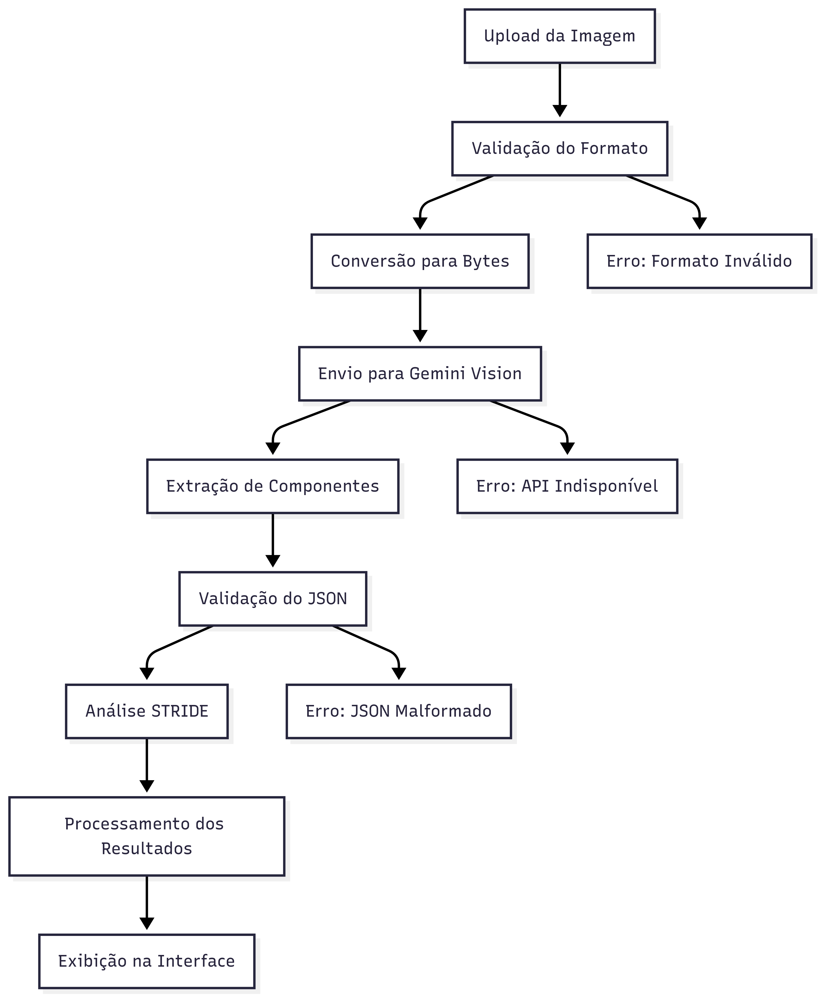

# 🛡️ Análise de Arquitetura e Vulnerabilidades com Gemini

## Visão Geral

Este projeto implementa uma solução automatizada para análise de vulnerabilidades em arquiteturas de sistemas em nuvem, utilizando o modelo Gemini Vision da Google para identificação de componentes e análise de ameaças baseada na metodologia STRIDE.

## Contexto do Desenvolvimento

A solução foi desenvolvida para automatizar o processo de análise de segurança em diagramas de arquitetura, permitindo que especialistas em segurança identifiquem rapidamente potenciais vulnerabilidades e obtenham sugestões de mitigação.

## Fluxo de Desenvolvimento da Solução

### 1. Análise de Requisitos

**Problema Identificado:**
- Análise manual de arquiteturas é demorada e propensa a erros
- Necessidade de identificar componentes automaticamente em diagramas
- Padronização da análise de ameaças usando metodologia STRIDE

**Requisitos Funcionais:**
- Upload de imagens de arquitetura (PNG, JPG, JPEG)
- Extração automática de componentes usando IA
- Análise de ameaças baseada na metodologia STRIDE
- Interface web intuitiva para apresentação dos resultados

### 2. Arquitetura da Solução

#### Componentes Principais:
```
┌─────────────────┐    ┌─────────────────┐    ┌─────────────────┐
│   Frontend      │    │   Backend       │    │   IA Service    │
│   Streamlit     │───▶│   Python        │───▶│   Gemini API    │
│                 │    │   Logic         │    │                 │
└─────────────────┘    └─────────────────┘    └─────────────────┘
```

#### Stack Tecnológica:
- **Frontend:** Streamlit (Interface web interativa)
- **Backend:** Python com bibliotecas especializadas
- **IA:** Google Gemini Vision para análise de imagens
- **Processamento:** PIL para manipulação de imagens
- **Dados:** JSON para estruturação de resultados

### 3. Implementação por Etapas

#### Etapa 1: Configuração do Ambiente
```python
# Configuração de variáveis de ambiente
- GOOGLE_API_KEY: Chave de acesso à API do Gemini
- GOOGLE_LLM_MODEL: Modelo específico do Gemini a ser utilizado
```

#### Etapa 2: Desenvolvimento da Interface
- **Layout responsivo** com Streamlit
- **Sidebar informativa** com instruções de uso
- **Sistema de upload** para imagens de arquitetura
- **Área de exibição** dos resultados em formato tabular

#### Etapa 3: Integração com Gemini Vision
**Função: `extract_components_from_image()`**
- Conversão de bytes da imagem para formato PIL
- Prompt engineering específico para extração de componentes
- Parsing da resposta JSON do modelo
- Tratamento de erros e validação

#### Etapa 4: Implementação da Análise STRIDE
**Função: `get_stride_analysis()`**
- Categorização das ameaças por tipo STRIDE:
  - **Spoofing** (Falsificação)
  - **Tampering** (Adulteração)
  - **Repudiation** (Repúdio)
  - **Information Disclosure** (Divulgação de Informações)
  - **Denial of Service** (Negação de Serviço)
  - **Elevation of Privilege** (Elevação de Privilégios)

#### Etapa 5: Processamento e Apresentação
- **Pipeline de processamento** em duas etapas
- **Indicadores de progresso** para feedback do usuário
- **Formatação dos resultados** em DataFrames pandas
- **Sistema de notificações** (toasts) para confirmação

### 4. Fluxo de Execução



O diagrama acima ilustra o fluxo completo de execução da aplicação:

1. **Upload da Imagem:** O usuário carrega o diagrama de arquitetura
2. **Processamento Inicial:** A imagem é convertida e preparada para análise
3. **Extração de Componentes:** O Gemini Vision identifica os componentes da arquitetura
4. **Análise STRIDE:** Cada componente é analisado quanto às ameaças de segurança
5. **Apresentação de Resultados:** Os dados são formatados e exibidos ao usuário


### 5. Tratamento de Erros

#### Níveis de Validação:
1. **Configuração:** Verificação de variáveis de ambiente
2. **Upload:** Validação de formato de arquivo
3. **API:** Tratamento de erros de comunicação
4. **Parsing:** Validação de estrutura JSON
5. **Apresentação:** Fallback para exibição de erros

### 6. Otimizações Implementadas

#### Performance:
- **Lazy loading** das bibliotecas
- **Cache de sessão** para evitar reprocessamento
- **Processamento assíncrono** com spinners

#### Usabilidade:
- **Interface responsiva** para diferentes dispositivos
- **Feedback visual** durante processamento
- **Mensagens de erro** contextualizadas

### 7. Estrutura de Dados

#### Input (Componentes Extraídos):
```json
{
  "componentes": [
    "AWS Shield",
    "Amazon CloudFront",
    "AWS WAF",
    "Application Load Balancer",
    "Auto Scaling Group"
  ]
}
```

#### Output (Análise STRIDE):
```json
[
  {
    "Categoria STRIDE": "Spoofing",
    "Ameaça Potencial": "Descrição da ameaça",
    "Componentes Afetados": "Lista de componentes",
    "Medida de Contorno Sugerida": "Sugestão de mitigação"
  }
]
```

## Instalação e Configuração

### Pré-requisitos
```bash
pip install streamlit google-generativeai pillow pandas python-dotenv
```

### Configuração
1. Criar arquivo `.env` na raiz do projeto:
```env
GOOGLE_API_KEY=sua_chave_api_aqui
GOOGLE_LLM_MODEL=gemini-1.5-flash
```

2. Executar a aplicação:
```bash
streamlit run app.py
```

## Uso da Aplicação

1. **Upload:** Carregue uma imagem da arquitetura (PNG, JPG, JPEG)
2. **Análise:** Clique em "Analisar Arquitetura com Gemini"
3. **Resultados:** Visualize os componentes identificados e a análise STRIDE

## Limitações e Considerações

- **Qualidade da Imagem:** Resultados dependem da clareza do diagrama
- **Revisão Humana:** Análise por IA deve ser validada por especialista
- **Cobertura:** Metodologia STRIDE pode não cobrir todas as ameaças específicas
- **Dependência Externa:** Requer conectividade com API do Google